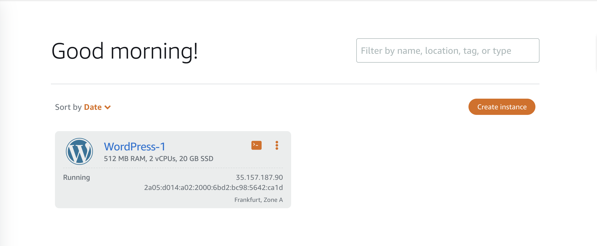
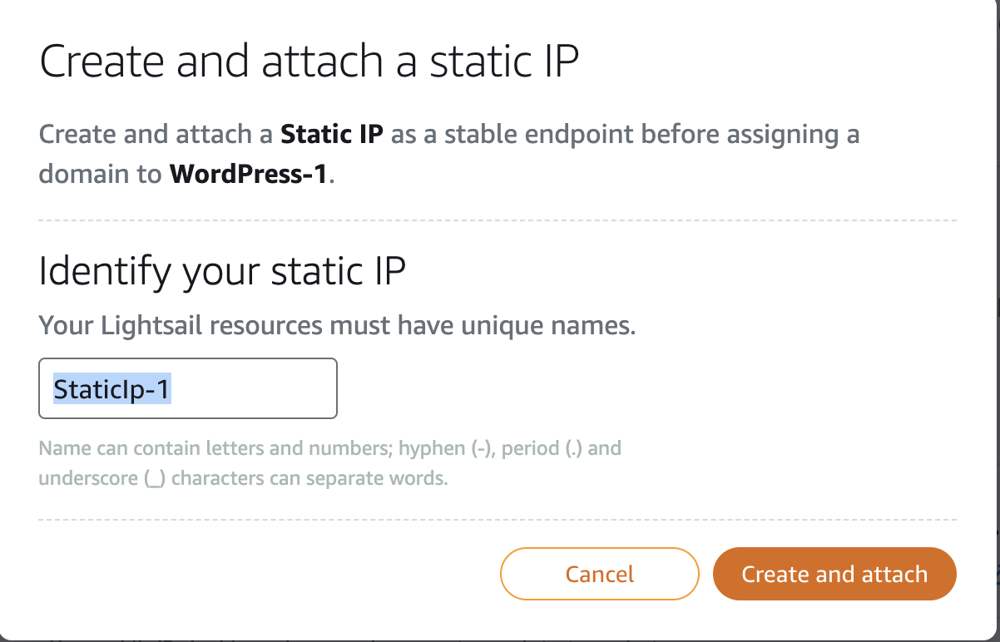

# Hands-On: Setting Up a WordPress Site in 5 Minutes on AWS

## Introduction

**WordPress**, powering over 43.3% of all websites on the Internet, is the simplest and most popular way to create your own website or blog. Indeed, more than one in four websites you visit are likely powered by WordPress.
There are various ways to set up a WordPress site. In this story, we will go through the hands-on process of setting up a WordPress site on AWS using the **Amazon Lightsail** service.
Amazon Lightsail is the easiest way to get started with Amazon Web Services (AWS) for developers who need to build websites or web applications. It includes everything you need to launch your project quickly - instances (virtual private servers), container services, managed databases, content delivery network (CDN) distributions, load balancers, SSD-based block storage, static IP addresses, DNS management of registered domains, and resource snapshots (backups) - for a low, predictable monthly price.

## Create Wordpress with Amazon Lightsail

1. Go to your Console on AWS and open `Lightsail`. 


2. Click the **Create Instance** button. 

The new window will open where you will see many options, and we will go through each one individually.


1. If you want to change Region or Availability Zone, click on **Change AWS Region and Availability Zone**. I will choose **eu-central-1** and **Zone A**


2. Pick your instance image, it will be Linux/Unix. As you can see, Linux/Unix supports 29 blueprints, out of which 16 are applications, and 13 are OS only. You will select WordPress.


3. Create new SSH key pair. Click on **Create new**, then **Create**. Name your SSH key pair and click the **Generate key pair**. Just download your private key. 


4. Choose your instance plan. I will choose the cheapest for this demo. 

Amazon Lightsail offers a variety of instance plans to cater to different needs. These plans are designed to be simple and cost-effective, making it easy for you to choose the right one for your project.

Instance plans are categorized based on the amount of memory, processor, storage, and data transfer that they provide. The smallest plan starts with 512 MB of memory, a 2-core processor, 20 GB of SSD storage, and 1 TB of data transfer. As the plans increase in price, so do the resources, with the largest plan offering 32 GB of memory, 8-core processor, 640 GB of SSD storage, and 7 TB of data transfer.

Each plan comes with a fixed, predictable monthly cost, which includes all the services and features of Lightsail like SSD-based storage, data transfer, DNS management, and a static IP.

It's important to choose a plan that best fits your application's needs. For example, if you're running a small blog, a smaller plan might suffice. But if you're running a high-traffic web application, you might need a larger plan.

You have to remember, **you can always start small and scale up as your needs grow.**


**NOTE: If you choose the first three cheapest options, you'll also receive three months for free.**

1. Identify your instance, I will choose default name **WordPress-1** and click the **Create Instance** button. 


2. You will have to wait a few seconds, and you will get WordPress up and running. 




1. Attach static IP address to your Wordpress instance. 
Click on the three dots and then select **Manage**.


Go to **Networking** and click the **Attach static IP** button. 


I will choose default name **StaticIp-1** and click the **Create and attach** button. 



1.  Go back to your **Instances** and connect to your Wordpress instance. 


2.  A new window with the terminal will open. The next step is to write the command:

```bash
ls
```
You will see `bitnami_application_password` file. 

Use command:

```bash
cat bitnami_application_password
```

and you will see your Wordpress password. 


1.  Copy static IP address of your instance and paste it in your address bar with **/wp-login.php.**

**Ex: 3.120.162.200/wp-login.php**

13. Login to your Wordpress site, with username: **user** and your password from terminal. 


1.  Welcome to your Wordpress site! 


2.  If you want to add **DNS** to your instance, [watch this](https://www.youtube.com/watch?v=49aOUHkvlgg)

## Conclusion 

Setting up a WordPress site on Amazon Lightsail is a straightforward and efficient process, offering a reliable way to host your website or blog on AWS infrastructure. With its user-friendly interface and pre-configured options, Lightsail streamlines the deployment of WordPress, enabling developers and users with limited AWS experience to launch their site quickly.

By following the step-by-step guide provided in this tutorial, you've learned how to:

1. Create an instance (virtual private server) on Amazon Lightsail.
2. Configure the WordPress application on the Lightsail instance.
3. Access and manage your WordPress site through the web browser.

Remember to regularly back up your WordPress site and stay updated with security measures to ensure a safe and smooth running website. Additionally, explore additional AWS services and configurations to enhance the performance, scalability, and security of your WordPress installation as your site grows.

Utilizing Amazon Lightsail for WordPress hosting provides a scalable and cost-effective solution for individuals, small businesses, or projects looking to establish an online presence without the complexity of managing traditional AWS services.

Experiment with various features and optimizations available within Lightsail to further customize your WordPress site and optimize its performance. As you delve deeper into AWS, consider integrating other services like Amazon RDS for database management or Amazon CloudFront for content delivery, depending on your specific needs.

Overall, with Amazon Lightsail, you've unlocked the potential to deploy, manage, and scale WordPress websites efficiently on AWS infrastructure, empowering you to focus more on your content and less on the underlying technicalities of hosting.


